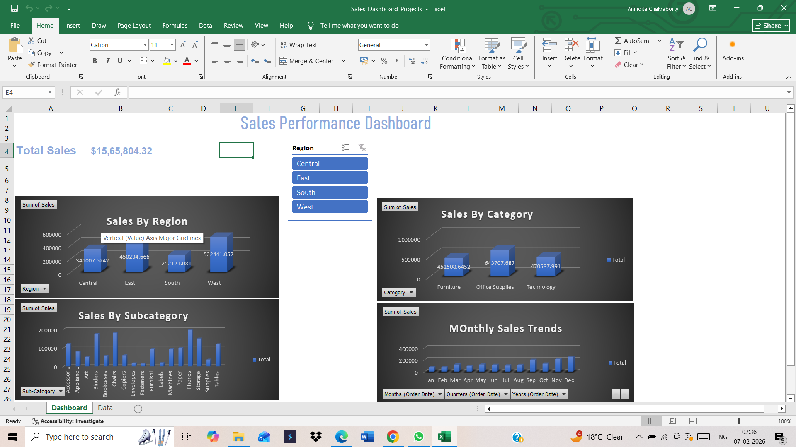
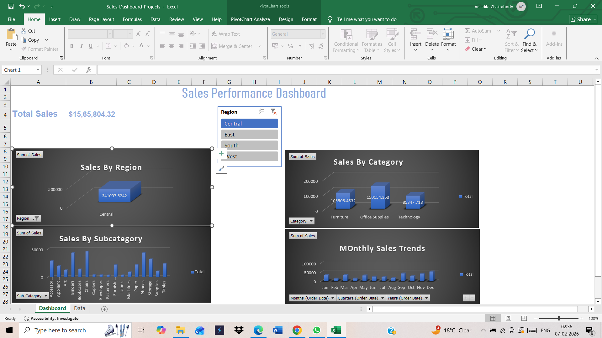
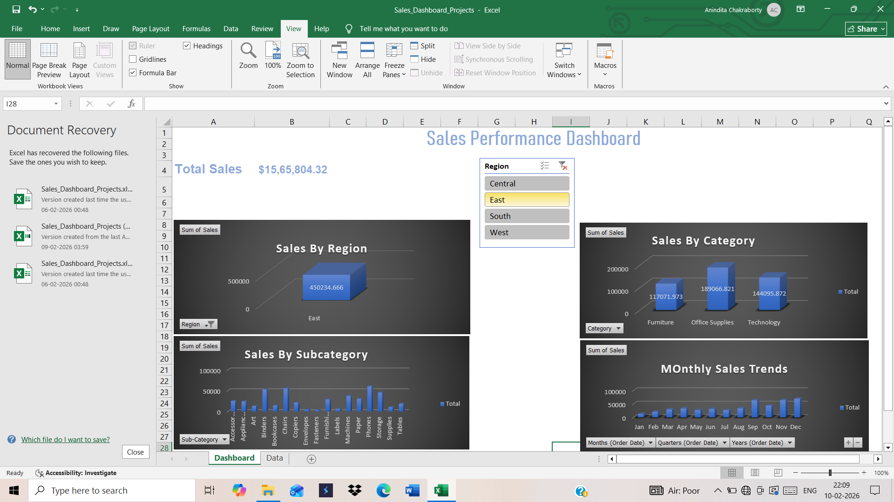
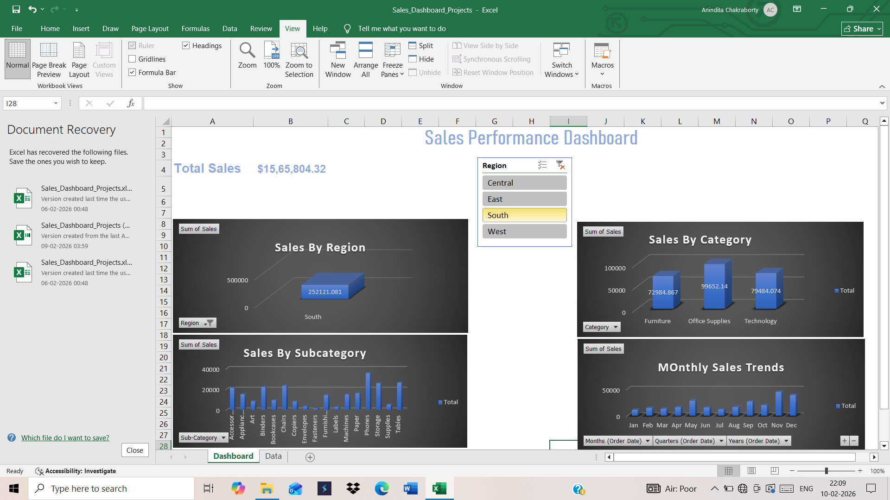
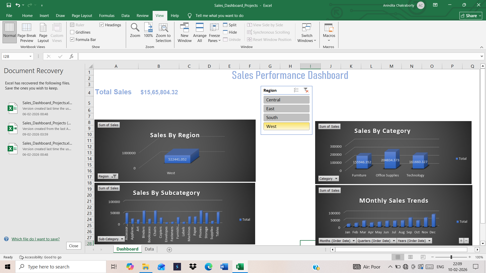

# Sales Performance Dashboard (Excel)

## 📌 Project Overview
This project analyzes sales data to identify revenue trends, top-performing products, and regional performance using Microsoft Excel.
## Dashboard Preview

### Overview

### Central Region

### East Region

### South Region

### West Region

## 🛠 Tools Used
- Microsoft Excel  
- Pivot Tables  
- Pivot Charts  
- Basic Excel formulas  

## 📊 Key Analysis
- Total sales by product  
- Sales by region  
- Monthly sales trend  
- Sales by category and Sub category  

## 📂 Files Included
- Excel raw data
- Excel dashboard file  
- Pivot tables    

## 🎯 Outcome
Identified high-performing products and regions to support business decisions.
